**System administrator by day, developer by passion.** 
I keep systems running, automate everything I can, and I'm currently leveling up as a **full stack web developer**.

 

<h2 align="center">🧰 Toolbox</h2>

<table align="center">
  <tr>
    <td align="center" width="180"><b>🌐 Web</b> current focus</td>
    <td></td>
  </tr>
  <tr>
    <td align="center"><b>🐍 Languages</b></td>
    <td></td>
  </tr>
  <tr>
    <td align="center"><b>🛡️ SysAdmin & Security</b></td>
    <td></td>
  </tr>
  <tr>
    <td align="center"><b>🎮 Games & Desktop</b></td>
    <td></td>
  </tr>
  <tr>
    <td align="center"><b>🛠️ Tools</b></td>
    <td></td>
  </tr>
</table>

<h2 align="center">✨ What I'm into</h2>

<table align="center">
  <tr>
    <td width="50%" valign="top">
      <h3>🌐 Full stack web</h3>
      
Learning by building: right now it's <b>TypeScript</b> and <b>React</b>. Latest project: <a href="https://github.com/RobeMarti/Anime-Tracker">Anime Tracker</a>, an installable PWA in vanilla JS.

    </td>
    <td width="50%" valign="top">
      <h3>🖥️ SysAdmin & automation</h3>
      
My day job: keeping infrastructure healthy and scripting away the boring stuff with <b>PowerShell</b>, <b>Bash</b> and <b>Python</b>.

    </td>
  </tr>
  <tr>
    <td width="50%" valign="top">
      <h3>🛡️ Cybersecurity</h3>
      
Hardening, networking and learning how things break, so I know how to keep them from breaking.

    </td>
    <td width="50%" valign="top">
      <h3>🎮 Game dev & side projects</h3>
      
Small games in <b>Godot</b>, desktop tools in <b>C#</b> like <a href="https://github.com/RobeMarti/Mouse-Jiggler">Mouse Jiggler</a>, and a soft spot for <b>C++</b>.

    </td>
  </tr>
</table>

 

<picture>
  <source media="(prefers-color-scheme: dark)" srcset="https://raw.githubusercontent.com/RobeMarti/RobeMarti/output/snake-dark.svg" />
  
</picture>

